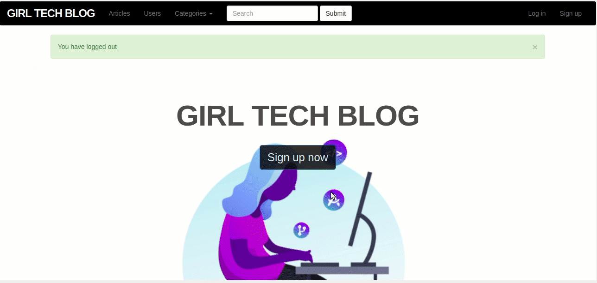

<h1 align="center">Welcome to Girl Tech Blog - Ruby on Rails 👋</h1>

> In this project I built a RESTful blog with full CRUD functionality. I applied MVC for users, posts and categories. 


### ✨ [Demo](https://girl-tech-blog.herokuapp.com/)

## Preview



## 👌 Features

- **Users**
  - Sign-up / login / logout.
  - Show the profile page.
  - Create / update / delete articles.
  - Can have many articles.

- **Articles**
  - Create, update and delete from owner and administrator.
  - Show in chronological update order.
  - Belongs to a User.

- **Comments**
  - Create / update / delete from owner.
  
  
- **Categories**
  - Create / update / from admnistrator.
  - Can have many articles.
  
## Install

Clone the repo and then install the needed gems:

```console
 bundle install --without production
```

Create and Migrate the database:

```console
 rails db:migrate
```

## Usage

Run the test suite to verify that everything is working correctly:

```console
 rspec
```

Run the app in a local server:

```console
 rails server
```


## Author

👤 **Amanda Vieira**

- Github: [@vieiramanda11](https://github.com/vieiramanda11)
- Twitter: [@mndvr_](https://twitter.com/mndvr_)
- Linkedin: [Amanda](https://www.linkedin.com/in/amandavieira23/)
- Email: [amandavieirazevedo@gmail.com]()
